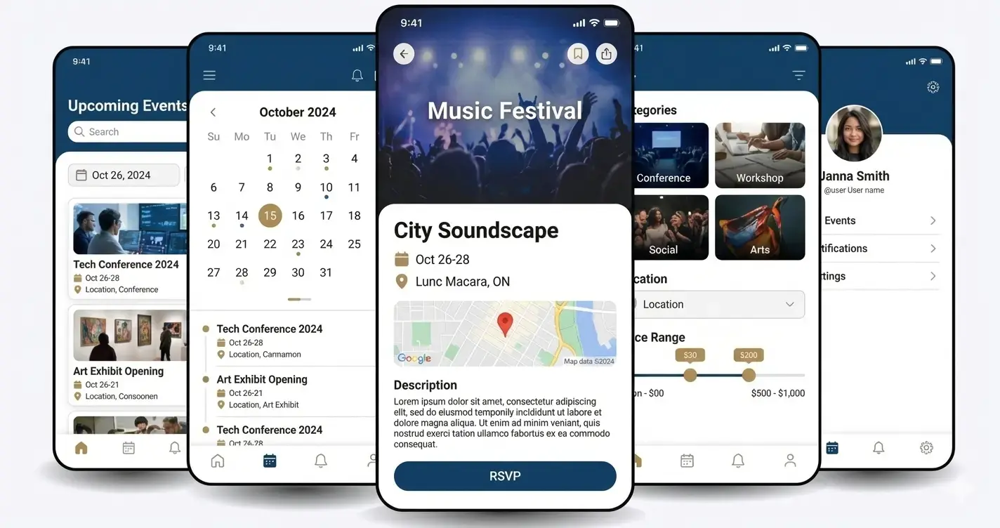

# Software in the Wild: Improving the Diyandi Experience Through Software

> **Name:** Steve Nash H. Llamedo  
> **Section:** CS3A
>   **Date submitted:** 2006-09-26

---

## 1. User group

**Who are you designing for?**  
Visitors

**Why might this group need support during Diyandi?**  
When we visit, or partake in the Diyandi festival we sometimes do not get the full event details or plans regarding areas that will be used for a event of the festival.

---

## 2. Situation or need

**What is this group trying to do during Diyandi?**  
Find the schedule of an event, updates, the list of ongoing events, and where it would be held in.

---

## 3. Problem or inconvenience

**What may make this task difficult, confusing, unsafe, slow, or inconvenient?**  
There would be interruptions regarding the event, and having the location name alone is vague specially for visitors outside the city which makes going to the venue very difficult.

---

## 4. Proposed digital solution

**What digital tool would you propose?**  
An interactive map that could be in the city's own gov app/website that would contain information about the events, and pin locations of where it would be held in and statuses regarding the event.

**How would it help the intended users?**  
It makes it easier to navigate and plan ahead for the festival on what they would like to do. Especially for tourists, having a digital platform for information regarding the event means the capability of being able to translate or change language of the tool to make it much more easier to use.

---

## 5. Things users can do

Describe **two specific actions** that users could perform using your proposed system.

1. Navigate throughout the system and see all the different locations where the event will be held, and see the current updates/information of that event when clicking the location.
2. Being able to see the full schedule of the festival in a timetable manner, and by clicking each event would redirect them to the full information of the event and even redirect the map to the event's location.

---

## 6. Important qualities

Identify **two qualities** that would make your proposed system useful. You may consider whether it should be easy to use, fast, reliable, safe, private, accessible, multilingual, low-data, clear, or available during high demand.

### Quality 1: Ease of Access

**Why does this matter to users?**  
Being able to easily navigate the system means we are able to improve and make the information of the festival more digestible for the target users.

### Quality 2: Regular Updates

**Why does this matter to users?**  
Since it is a festival, having interruptions and changes regarding an event is unavoidable, and being able to show these updates cleanly is an important quality. The app should be able to locally save these updates as well, since the signal gets cut off during the actual time of a major event.

---

## 7. How to tell whether the solution helped

How could you determine whether your proposed solution actually helped users?

Check for changes in the number where questions about event informations is being asked, and check the number of attendees for the event.

---

## 8. Screenshot or reference

The first 3 images from the left shows what I imagine the interactive tool would look like.

---

## AI use declaration

Select **one** option below and complete the applicable details.

- [x] **No AI tools used.** I did not use any generative AI tool in preparing this submission.

- [ ] **AI tools used.** I used the following AI tool(s): [Write tool name(s), e.g., ChatGPT, Gemini, Copilot].

> I understand that I remain responsible for the accuracy, originality, and quality of this submission. I confirm that I reviewed and revised any AI-generated content and can explain all ideas submitted under my name.

---

## Student declaration

I confirm that this work is based primarily on my own observation, experience, and reasoning. Any external sources or tools used have been acknowledged above.

**Name:** Steve Nash H. Llamedo
